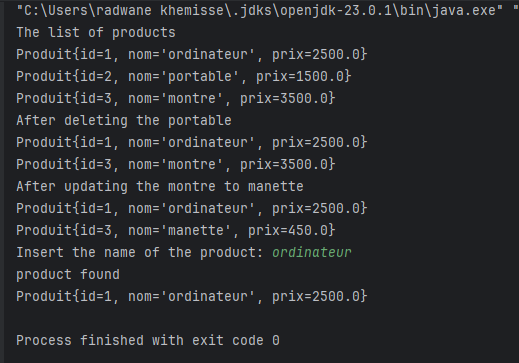
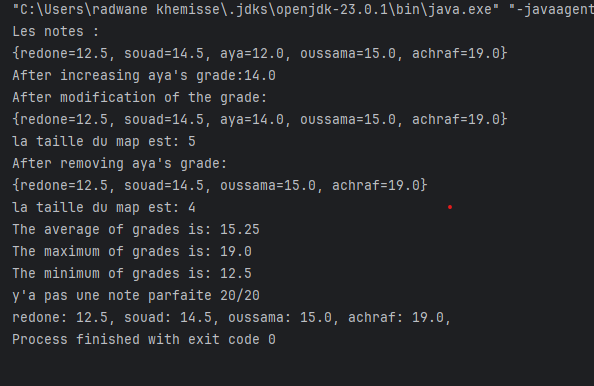
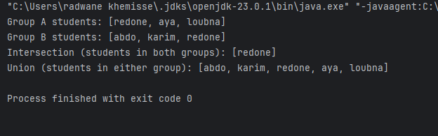

# Java Collections Practical Activity

**Author:** Radwane Khemisse  
**Date:** November 2024

## Introduction
This practical activity focuses on mastering the manipulation of Java Collections. Through step-by-step tasks, we work with `ArrayList`, `HashMap`, and `HashSet` to perform operations such as adding, updating, searching, and removing elements. Each step is accompanied by the relevant code.

---

## Exercises

### Exercise 1: Lists
The goal of this exercise is to create a simple application to manipulate a list of `Produit` objects.

#### Step 1: Add Products
Add products to an `ArrayList`. 

**Code:**
```java
    ArrayList<Produit> produits = new ArrayList<>();
    produits.add(new Produit(1, "ordinateur", 2500));
    produits.add(new Produit(2, "portable", 1500));
    produits.add(new Produit(3, "montre", 3500));
```

#### Step 2: Display Product List
Display all products in the `list`.

**Code:**
```java
    produits.forEach(System.out::println);
```
#### Step 3: Delete a Product by Index
Remove a product at a specific index (e.g., index 1).

**Code:**
```java
    produits.remove(1);
```
#### Step 4: Update a Product by Index
Retrieve and modify the product at index 1.

**Code:**
```java
    Produit prod = produits.get(1);
    prod.setNom("manette");
    prod.setPrix(450);
```
#### Step 5: Search for a Product by Name
Prompt the user to enter a product name and search for it in the list.

**Code:**
```java
    Scanner sc = new Scanner(System.in);
    System.out.println("Insert the name of the product:");
    String name = sc.nextLine();
    produits.stream()
        .filter(p -> p.getNom().equals(name))
        .findFirst()
        .ifPresentOrElse(System.out::println, () -> System.out.println("Product not found"));
```
#### Output Example:



### Exercise 2: Maps
This exercise involves working with a `HashMap` to store and manipulate student grades.

#### Step 1: Add Student Grades
Create a `HashMap` and add student grades.

**Code**
```
    HashMap<String, Double> grades = new HashMap<>();
    grades.put("oussama", 15.0);
    grades.put("redone", 12.5);
    grades.put("aya", 12.0);
    grades.put("achraf", 19.0);
    grades.put("souad", 14.5);
```
#### Step 2: Display All Grades
Print all student grades.
**Code**
```
    grades.forEach((name, grade) -> System.out.println(name + ": " + grade));
```
#### Step 3: Increase a Student's Grade
Increase the grade of a specific student (e.g., "aya") by 2.
```
    grades.put("aya", grades.get("aya") + 2.0);
```
#### Step 4: Remove a Student's Grade
Remove a specific student's grade (e.g., "oussama").

**Code**
```
    grades.remove("oussama");
```
#### Step 5: Display the Map Size
Print the size of the map.

**Code**
```
    System.out.println("Map size: " + grades.size());
```
#### Step 6: Calculate Average, Max, and Min Grades
Compute and display the average, maximum, and minimum grades.

**Code**
```
    Double avg = grades.values().stream().mapToDouble(Double::doubleValue).average().orElse(0.0);
    Double max = grades.values().stream().mapToDouble(Double::doubleValue).max().orElse(0.0);
    Double min = grades.values().stream().mapToDouble(Double::doubleValue).min().orElse(0.0);

    System.out.println("Average: " + avg);
    System.out.println("Maximum: " + max);
    System.out.println("Minimum: " + min);
```
#### Step 7: Check for Perfect Grade (20.0)
Check if there is a grade of 20.0 in the map.

**Code**
```
    boolean hasPerfectGrade = grades.containsValue(20.0);
    System.out.println("Has perfect grade 20/20? " + hasPerfectGrade);
```
#### Output Example:


### Exercise 2: Maps
This exercise demonstrates the use of `HashSet` to manage student groups and perform set operations.
#### Step 1: Add Students to Groups
Create two `HashSets` and add student names to each.

**Code**
```
    HashSet<String> groupA = new HashSet<>();
    HashSet<String> groupB = new HashSet<>();

    groupA.add("redone");
    groupA.add("aya");
    groupA.add("loubna");

    groupB.add("abdo");
    groupB.add("karim");
    groupB.add("redone");
```
#### Step 2: Display Intersection of Groups
Find and display the students present in both groups.

**Code**

    HashSet<String> intersection = new HashSet<>(groupA);
    intersection.retainAll(groupB); // Intersection
    System.out.println("Intersection: " + intersection);

#### Step 3: Display Union of Groups
Find and display all unique students in both groups.

**Code**

    HashSet<String> union = new HashSet<>(groupA);
    union.addAll(groupB); // Union
    System.out.println("Union: " + union);

#### Output Example:


## Conclusion
This practical activity provided hands-on experience with Java Collections, including `ArrayList`, `HashMap`, and `HashSet`. By following a step-by-step approach, we performed essential operations and practiced their real-world applications in Java.


