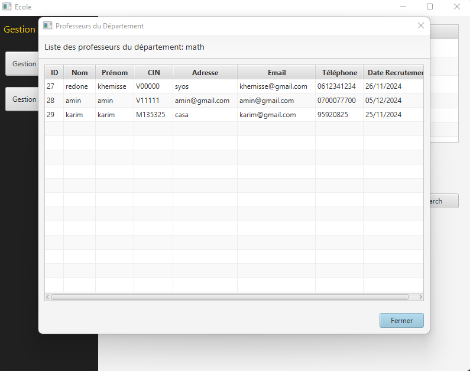
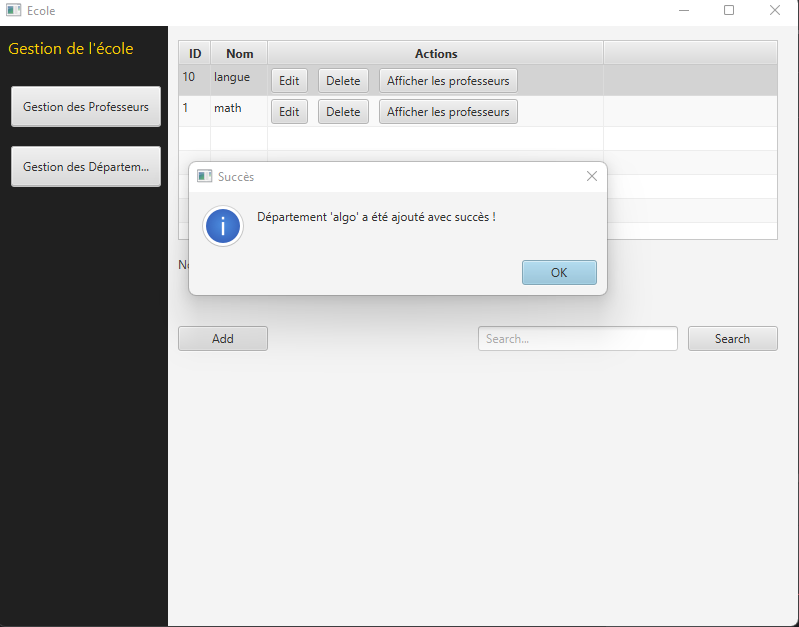
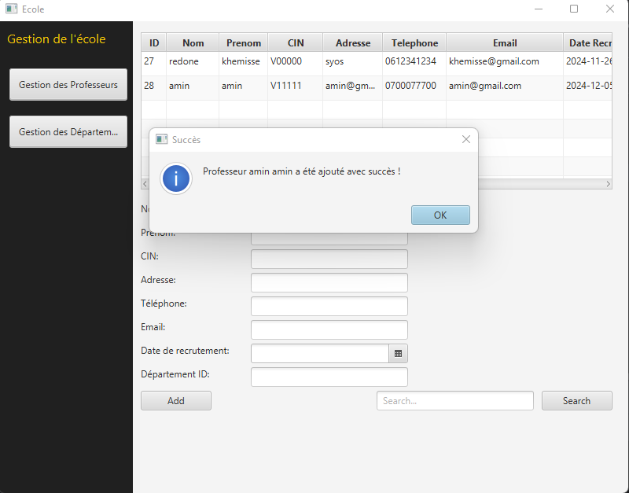
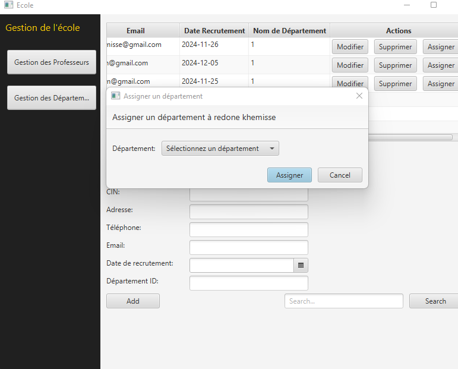
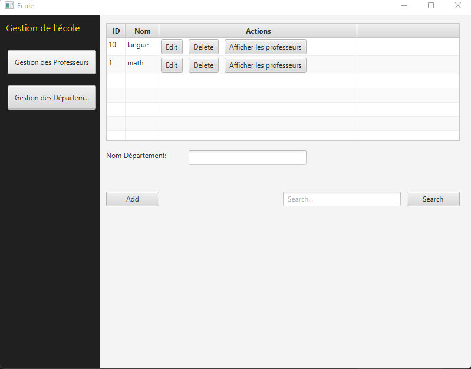
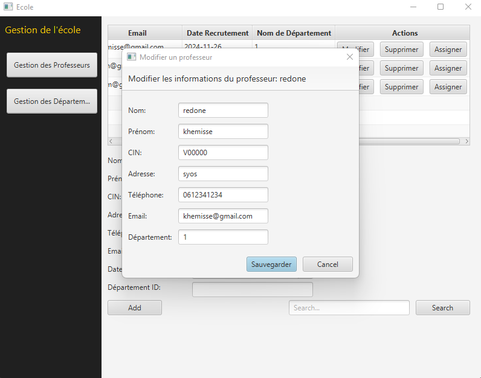
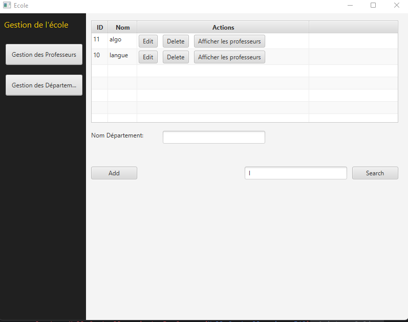
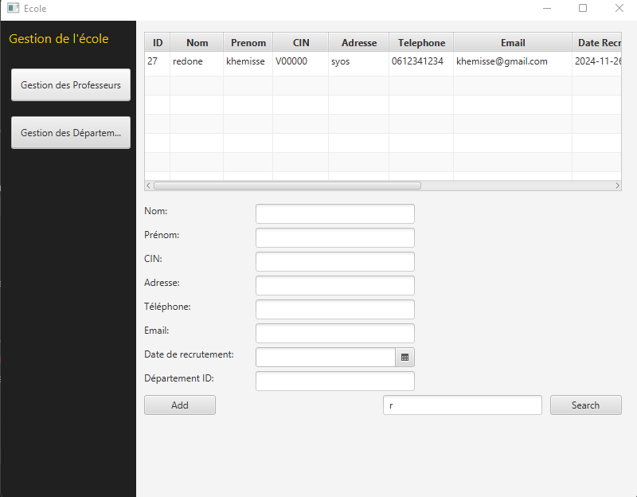
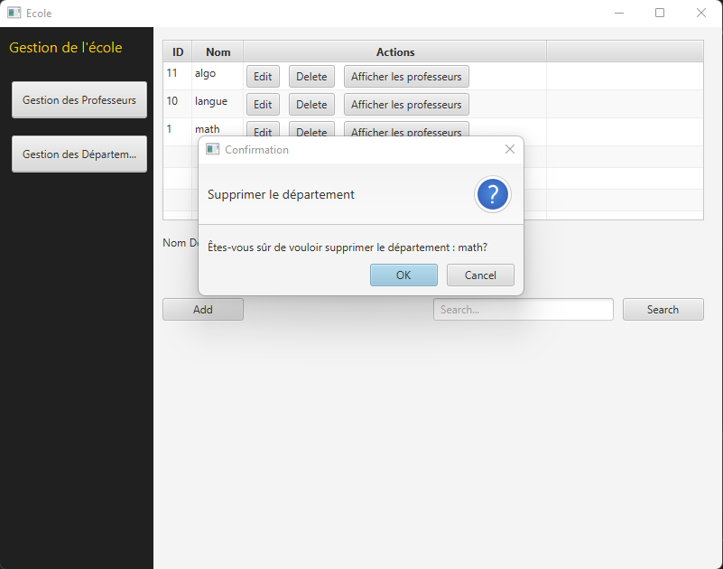
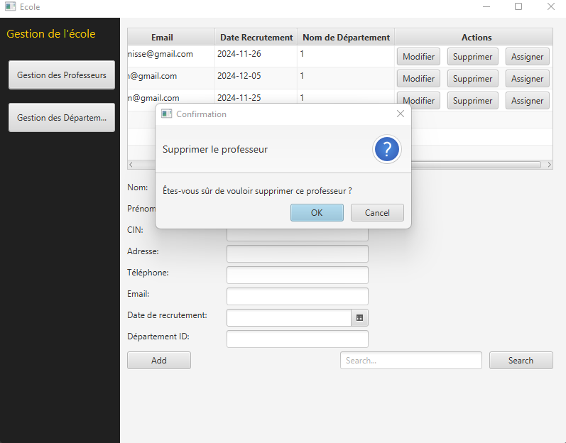

# School Management System

## Introduction

The **School Management System** is a JavaFX-based application that facilitates the management of professors and departments within an educational institution. The system allows users to manage professors' information, assign professors to specific departments, add new departments, search for records, and perform various CRUD (Create, Read, Update, Delete) operations. This project aims to simplify administrative tasks by providing a user-friendly interface for efficiently managing school data.

## Features

- **Gestion des Professeurs (Professor Management):**
    - Add, edit, delete, and search professors.
    - Assign professors to departments.
    - View professors based on department.

- **Gestion des Départements (Department Management):**
    - Add, edit, and delete departments.
    - View and manage departments with the list of associated professors.

- **Search Functionality:**
    - Search for professors and departments using keywords.

## Project Structure

The project consists of several key components:

1. **UI Components**: The application uses JavaFX for the graphical user interface (GUI). Screens are divided into two main panels: one for managing professors and the other for managing departments.
2. **Business Logic**: The `IMetier` interface defines methods for performing CRUD operations, while `MetierImpl` provides the implementation.
3. **Database Connection**: The application uses a MySQL database to store information about professors and departments.
4. **Screenshots**: Screenshots of different scenes in the application can be found in the `screenshots` folder to provide visual representations of the functionality.

## Screenshots

The following screenshots illustrate the different scenes of the application:

1. **Afficher Professeur par Département**  
   

2. **Ajout Département**  
   

3. **Ajout Professeur**  
   

4. **Assigner Département**  
   

5. **Gestion des Départements**  
   

6. **Modifier Professeur**  
   

7. **Search by Keyword for Department**  
   

8. **Search by Keyword for Professor**  
   

9. **Supprimer Département**  
   

10. **Supprimer Professeur**  
    

## Conclusion

The **School Management System** provides a powerful and intuitive interface for managing professors and departments in a school setting. By allowing users to quickly add, edit, and delete records, it significantly improves the efficiency of administrative tasks. The system also includes robust search functionality, making it easy to find specific records based on keywords.

This project serves as a good example of how JavaFX and a simple database can be used to build practical applications for educational institutions or other organizations.
