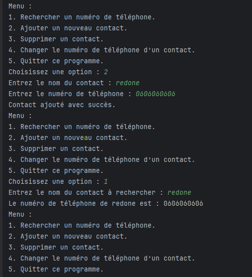

# Java Project - TP 6: Généricité et Entrées Sorties

## Introduction

This project demonstrates the implementation of several core Java concepts, including file input/output, serialization, and object management using generics. It provides solutions to three exercises focusing on simulating file directory operations, managing a contact directory, and saving and reading serialized objects for products and clients. The importance of this project lies in its practical application of file handling and object-oriented programming principles to solve real-world tasks such as managing directories, contacts, and business data.

## Implementation

### Exercice 1: The commande "ls" Simulation

This exercise simulates the Unix/Linux `ls` command to list files and directories in a specified path. It checks file types and access permissions (read, write, and hidden) and displays them in a structured format.

Exemple Implementation:

### Exercice 2: Gestion du Dossier Contact

This exercise involves managing a directory of contacts stored as files. Each file contains a contact's phone number, and the user can search, add, delete, and modify contact information.
Exemple Implementation:

### Exercice 3: Gestion des Produits et Clients avec Sérialisation

This exercise covers object serialization to save and load product and client data. It implements interfaces and classes to manage products and clients, allowing addition, deletion, and saving of entities.
Exemple Implementation:

## Conclusion

This project integrates several advanced Java concepts such as file handling, object serialization, and the use of interfaces with generics. The exercises provided practical use cases such as managing directories, contacts, and product inventories, which are common in real-world applications. The approach to serializing objects ensures that the data is preserved across sessions, making the system more efficient and reliable for long-term usage.
