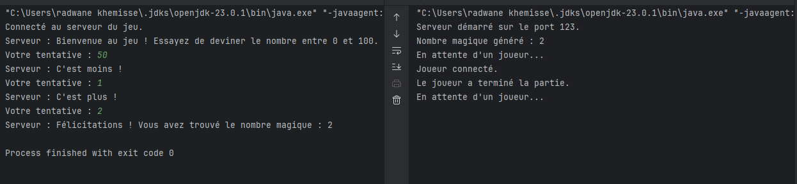
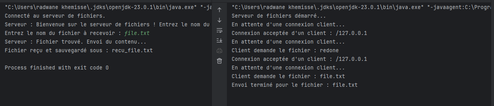

# Network Programming with Sockets

## Introduction
This practical activity involves the implementation of network programming using Java sockets. It aims to develop an understanding of socket communication and multithreading by building two applications:

1. A game server where players attempt to guess a magic number.
2. A file server that allows clients to request and download files.

These exercises are essential for mastering client-server architectures, understanding TCP communication, and implementing concurrent processing using threads.

---

## Exercise 1: Magic Number Game
### Objective
Create a server that generates a random magic number between 0 and 100 and allows players to guess the number. The server provides feedback ("higher" or "lower") until the player guesses correctly.

### Code Implementation
#### Server Code
```java
package EXO1;

import java.io.*;
import java.net.*;

public class Server {
    public static void main(String[] args) {
        try (ServerSocket serverSocket = new ServerSocket(12345)) {
            System.out.println("Server started on port 12345.");

            // Generate a random magic number between 0 and 100
            int magicNumber = (int) (Math.random() * 100);
            System.out.println("Magic number generated: " + magicNumber);

            while (true) {
                System.out.println("Waiting for a player...");
                try (Socket socket = serverSocket.accept();
                     BufferedReader br = new BufferedReader(new InputStreamReader(socket.getInputStream()));
                     PrintWriter out = new PrintWriter(socket.getOutputStream(), true)) {

                    System.out.println("Player connected.");
                    out.println("Welcome! Try to guess the magic number between 0 and 100.");

                    boolean win = false;
                    while (!win) {
                        String input = br.readLine();
                        if (input == null) break;

                        try {
                            int guess = Integer.parseInt(input);

                            if (guess < magicNumber) {
                                out.println("Higher!");
                            } else if (guess > magicNumber) {
                                out.println("Lower!");
                            } else {
                                out.println("Congratulations! You found the magic number: " + magicNumber);
                                win = true;
                            }
                        } catch (NumberFormatException e) {
                            out.println("Please enter a valid number!");
                        }
                    }
                    System.out.println("Player finished the game.");
                } catch (IOException e) {
                    System.err.println("Communication error with player: " + e.getMessage());
                }
            }
        } catch (IOException e) {
            System.err.println("Server error: " + e.getMessage());
        }
    }
}
```

#### Client Code
```java
package EXO1;

import java.io.*;
import java.net.*;
import java.util.Scanner;

public class Client {
    public static void main(String[] args) {
        try (Socket socket = new Socket("localhost", 12345);
             BufferedReader br = new BufferedReader(new InputStreamReader(socket.getInputStream()));
             PrintWriter out = new PrintWriter(socket.getOutputStream(), true);
             Scanner scanner = new Scanner(System.in)) {

            System.out.println("Connected to the game server.");

            String message;
            while ((message = br.readLine()) != null) {
                System.out.println("Server: " + message);
                if (message.startsWith("Congratulations")) break;

                System.out.print("Your guess: ");
                String guess = scanner.nextLine();
                out.println(guess);
            }
        } catch (IOException e) {
            System.err.println("Client error: " + e.getMessage());
        }
    }
}
```

### Execution 


---

## Exercise 2: File Server
### Objective
Develop a file server that supports multiple clients using threads. The server listens for client connections, processes file requests, and sends the file content if it exists.

### Code Implementation
#### Server Code
```java
package EXO2;

import java.io.*;
import java.net.*;

public class Server {
    public static void main(String[] args) {
        int port = 12345;

        System.out.println("File server started...");
        try (ServerSocket serverSocket = new ServerSocket(port)) {
            while (true) {
                System.out.println("Waiting for a client connection...");
                Socket clientSocket = serverSocket.accept();
                System.out.println("Client connected: " + clientSocket.getInetAddress());

                new Thread(new ClientHandler(clientSocket)).start();
            }
        } catch (IOException e) {
            System.err.println("Server error: " + e.getMessage());
        }
    }
}

class ClientHandler implements Runnable {
    private final Socket clientSocket;

    public ClientHandler(Socket clientSocket) {
        this.clientSocket = clientSocket;
    }

    @Override
    public void run() {
        try (
                BufferedReader in = new BufferedReader(new InputStreamReader(clientSocket.getInputStream()));
                PrintWriter out = new PrintWriter(clientSocket.getOutputStream(), true)
        ) {
            out.println("Welcome to the file server! Enter the file name you wish to receive.");

            String fileName = in.readLine();
            if (fileName != null) {
                File file = new File(fileName);

                if (file.exists() && file.isFile()) {
                    out.println("File found. Sending content...");
                    try (BufferedInputStream fileReader = new BufferedInputStream(new FileInputStream(file))) {
                        byte[] buffer = new byte[1024];
                        int bytesRead;
                        while ((bytesRead = fileReader.read(buffer)) != -1) {
                            clientSocket.getOutputStream().write(buffer, 0, bytesRead);
                        }
                        clientSocket.getOutputStream().flush();
                    }
                } else {
                    out.println("Error: File does not exist.");
                }
            }
        } catch (IOException e) {
            System.err.println("Error handling client: " + e.getMessage());
        } finally {
            try {
                clientSocket.close();
            } catch (IOException e) {
                System.err.println("Error closing client connection: " + e.getMessage());
            }
        }
    }
}
```

#### Client Code
```java
package EXO2;

import java.io.*;
import java.net.*;
import java.util.Scanner;

public class Client {
    public static void main(String[] args) {
        String serverAddress = "localhost";
        int port = 12345;

        try (Socket socket = new Socket(serverAddress, port);
             BufferedReader in = new BufferedReader(new InputStreamReader(socket.getInputStream()));
             PrintWriter out = new PrintWriter(socket.getOutputStream(), true);
             Scanner scanner = new Scanner(System.in)) {

            System.out.println("Connected to the file server.");

            System.out.println("Server: " + in.readLine());

            System.out.print("Enter the file name to receive: ");
            String fileName = scanner.nextLine();
            out.println(fileName);

            String response = in.readLine();
            if (response.startsWith("File found")) {
                System.out.println("Server: " + response);

                try (FileOutputStream fileOut = new FileOutputStream("received_" + fileName)) {
                    byte[] buffer = new byte[1024];
                    int bytesRead;

                    InputStream inputStream = socket.getInputStream();
                    while ((bytesRead = inputStream.read(buffer)) != -1) {
                        fileOut.write(buffer, 0, bytesRead);
                    }
                }
                System.out.println("File saved as: received_" + fileName);
            } else {
                System.out.println("Server: " + response);
            }
        } catch (IOException e) {
            System.err.println("Client error: " + e.getMessage());
        }
    }
}
```

### Execution 


---

## Conclusion
This TP introduced fundamental concepts of network programming using Java sockets. The first exercise emphasized server-client interaction with a simple guessing game, while the second explored multithreading and file transmission. These exercises provide a solid foundation for building more complex client-server applications.
